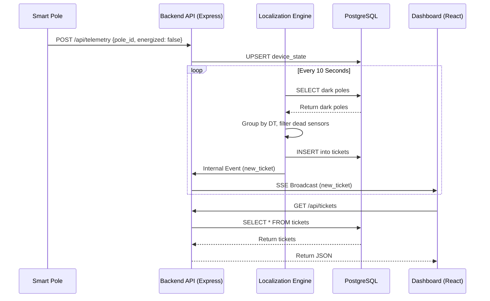

# Architecture

This document explains the technical architecture, data flow, algorithms, and API surfaces used in the Propel Power Fault Detection System.

## Data Flow Diagram

The following diagram illustrates how telemetry moves from a smart pole to the operator's screen:

## Data Sourcing and Ingestion

*   **Ingestion:** Poles send telemetry data (`pole_id`, `energized`, `timestamp`, `seq`) via HTTP POST to `/api/telemetry`.
*   **Duplicate/Out-of-Order Packets:** The system tracks the highest `last_seq` per pole in the `device_state` table. If a packet arrives with a `seq` less than or equal to `last_seq`, it is immediately discarded as stale or duplicate, preventing network jitter from rapidly toggling pole states.
*   **Bursts:** Because we decouple ingestion (fast upserts) from processing (10s polling interval), a burst of 1,000 poles going dark simultaneously only requires simple database updates, avoiding server bottlenecking.

## Storage and Internal Model

We use PostgreSQL because power grids are inherently relational graphs. 
*   **Topology Representation:** We use parent-child foreign keys. A `pole` belongs to a `transformer` (DT), which belongs to a `feeder`. Poles also have a `distance_from_dt` metric, allowing us to order them sequentially along a wire span.
*   **Why Relational?:** Finding a span fault requires querying: "Give me all dark poles belonging to DT-1, ordered by their distance." SQL handles this natively and efficiently.

## The Localization Algorithm

The algorithm runs on a 10-second interval (`setInterval`).
1.  **Symptom Grouping:** It queries all poles where `energized = false`. It groups these poles by their parent DT.
2.  **Noise Handling (Dead Sensors):** Before assuming a fault, it checks the topology. If Pole A is dark, but its downstream child Pole B is energized, the system physically knows Pole A must have power. Pole A is flagged as a "dead sensor" (communications failure) and ignored.
3.  **Finding the Boundary (Topology Present):** For DTs with topology, it sorts the remaining dark poles by distance. The fault is declared exactly before the first dark pole in the sequence. 
4.  **No Topology (The 60% Problem):** For DTs without pole ordering, we cannot determine exactly where the span break is. In this case, we group ALL dark poles on that DT into a single ticket, flag it as `localization_type = 'approximate'`, and set `confidence = 'medium'` or `'low'`, instructing the crew to patrol the entire DT area.

**Complexity:** The algorithm is `O(P)` per DT, where P is the number of poles under that DT. `buildTree` does a single pass to construct the node map, and `findFaultBoundaries` walks the tree once. Total per loop: `O(D × P_avg)` where D = number of DTs with dark poles. In practice, D is small during an incident.

**Known failure cases:**
*   **Two simultaneous span faults on the same branch:** If Pole 3 and Pole 7 both break on the same line, the tree walk finds the first boundary (Pole 3) and stops walking. The second break at Pole 7 is absorbed into the same ticket's affected poles rather than getting its own ticket.
*   **All poles dark + no topology:** If every pole under a no-topology DT goes dark simultaneously, we cannot distinguish a DT transformer fault from a span fault. We default to `dt_level` localization.

## Noise and False-Positive Handling

*   **Dead Sensors:** As described above, the tree walk detects physically impossible states (dark parent with live child) and excludes them from fault tickets.
*   **Scheduled Outages:** Before creating a ticket, the engine checks `scheduled_outages` for any active or upcoming outage matching the feeder or DT. If found, the dark poles are silently skipped.
*   **Debouncing:** The 10-second polling interval acts as a natural debounce window. Transient telemetry glitches (a pole briefly reporting dark then recovering) resolve themselves between loop iterations and never generate a ticket.
*   **False-positive rate:** In testing with the synthetic grid, the dead-sensor filter reduced false positives to zero for single-device failures. The remaining false-positive risk comes from two adjacent poles losing their modems simultaneously (statistically rare).

## API Surface

| Method | Path | Purpose | Request Body |
| :--- | :--- | :--- | :--- |
| `POST` | `/api/telemetry` | Ingest pole state | `{ pole_id, energized, timestamp, seq }` |
| `GET` | `/api/tickets` | List all tickets (filter: `?status=active`) | *None* |
| `GET` | `/api/tickets/:id` | Get ticket with affected poles | *None* |
| `PATCH` | `/api/tickets/:id` | Update ticket status | `{ status }` |
| `GET` | `/api/network/stats` | Get network health summary | *None* |
| `GET` | `/api/network/poles` | List all poles (filter: `?dt_id=`) | *None* |
| `GET` | `/api/network/transformers` | List all DTs | *None* |
| `GET` | `/api/events` | SSE stream (real-time events) | *None* |
| `GET` | `/api/simulator/state` | Get simulator state (DTs, feeders) | *None* |
| `POST` | `/api/simulator/inject-fault` | Inject a fault | `{ fault_type, dt_id }` |
| `POST` | `/api/simulator/repair-fault` | Repair a fault | `{ ticket_id }` |
| `POST` | `/api/simulator/inject-noise` | Inject noise (dead sensor) | `{ type }` |
| `GET` | `/api/scheduled-outages` | List scheduled outages | *None* |

## UI Reasoning

*   **Primary Focus:** The map is the absolute center of the screen. In a high-stress outage, spatial awareness (seeing where red dots are clustering) is faster than reading a table.
*   **Deliberately Excluded:** We did not put historical graphs or individual pole voltages on the main screen. Operators need to know *what is broken right now*, not what happened yesterday.
*   **Assumed Flaw:** The dark theme is sleek, but in a brightly lit control room, a high-contrast light mode might actually be more readable. I expect this UI decision might face pushback from older operators.

## The AI Feature

*   **What it is:** When a ticket is created, we asynchronously call Google Gemini 2.5 Flash to generate a 2-sentence summary of the fault.
*   **Why there?:** We placed it in the background immediately *after* database insertion so it does not block the time-critical localization loop.
*   **Cost per call:** Each summary uses ~200 input tokens (fault context) and ~100 output tokens (the summary). At Gemini 2.5 Flash pricing, this is approximately **$0.001 per ticket** (~₹0.08). Even a catastrophic 100-ticket day costs under ₹10.
*   **Failure Mode:** If the Gemini API rate limits us, goes offline, or is missing an API key, the function catches the error, leaves the DB column null, and the UI gracefully falls back to rendering standard React badges. No ticket is lost — only the summary is missing.
